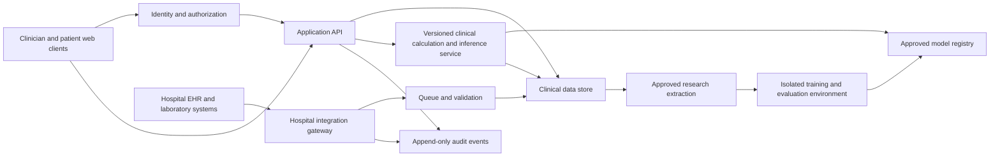

# VitalCKM technical architecture and scaling brief

Prepared 7 September 2026. This describes the inspected demo and a proposed production architecture. Proposed services, integrations, performance objectives and controls are not implemented or benchmarked unless explicitly marked current.

## Current system

The UI is a React 19.2.6 / TypeScript application using Vinext 1.0.0-beta.5 and Vite 8.0.13, with Tailwind styling and Base UI/Shadcn primitives. It can run on a local Node development server. Its build scaffold supports a Cloudflare Worker deployment; that support is not a production healthcare architecture or certification.

| Current module | Responsibility | Limitation |
|---|---|---|
| `app/page.tsx` | Screens, forms, role preview and record changes | Large combined component; split by workflow before substantial expansion |
| `lib/demo.ts` | 8 deterministic synthetic patients, 270 observations, 9 medication entries, 16 tasks; latest-result selection and basic validation | Not a general hospital data model or ingestion service |
| `lib/clinical.ts` | BMI, CKD-EPI 2021 reference eGFR, UACR conversion and G/A categories | Fixed calculations only; no clinical outcome model |
| Browser localStorage | Saves demo records under one browser origin | No tenant isolation, shared database, durable audit history or server validation |
| Role switch | Previews patient and clinician perspectives | Not authentication or authorization |
| JSON download and browser printing | Local selected-record export and visible-view printing | Not EHR write-back or a hospital document service |
| Optional WebMCP registration | Lists/opens demo patients in a supporting browser | Unverified optional interface; not a hospital API or security control |

Nine automated tests, TypeScript checking and production compilation passed. Comprehensive UI/accessibility tests, load tests and clinical validation remain outstanding. The installer reported 11 dependency advisories, including 8 high-severity reports; affected components and deployment exposure were not fully triaged. Audit and resolve relevant issues before production use. Reassess the beta framework's support and upgrade path rather than assuming the demo framework must be retained indefinitely.

## Recommended evolution

Retain the useful UI and domain concepts. Replace the browser-local record store and role simulation with server-backed application services. Start with a modular application rather than many microservices. Isolate integration jobs and model inference where operational or security boundaries justify it.

This is a proposed architecture. Hosting location, network boundaries and data flows must be approved with each healthcare organization. A public edge frontend may be appropriate without placing the clinical database or training data there. Hospital-resident or approved regional services can expose authenticated HTTPS APIs. A Sites/Workers frontend must not attempt raw TCP/MLLP connectivity; terminate legacy hospital interfaces in an appropriate gateway and forward through approved HTTP interfaces.

### Application and storage design

- Split UI features into patient directory, overview, observations, medication reconciliation, care plans, check-ins and methods. Extract typed services and hooks from page-level state.
- Define versioned API contracts, server validation and domain types independently of the UI. Use explicit error codes for unavailable, stale, invalid and ineligible inputs.
- Use a durable relational store, such as an approved PostgreSQL deployment, for patient-linked records. This is a proposed engineering choice, not a requirement imposed by FHIR.
- Every record and query must have an authorized organization/tenant context. Enforce access in the API and database layer where appropriate. Do not trust a browser-provided patient or tenant ID without an authorization check.
- Keep direct identity linkage in a restricted service/table. Use institution-scoped identifiers and a managed matching process; never merge people merely because names or birth dates resemble one another.
- Keep large documents and approved model artifacts in encrypted object storage with lifecycle policies and access controls. Do not put attachments in JSON arrays inside patient rows.
- Remove clinical records and access tokens from persistent browser localStorage. Use an approved session design, narrow browser caching and protected server-side token handling.
- Replace whole-array patient updates with granular, versioned operations. Use optimistic concurrency to prevent one clinician overwriting another's changes.

## Production data model

The expanded workbook is a starting specification, not an exact production schema. The demo uses a smaller subset and lacks important temporal/clinical metadata.

| Entity | Minimum important properties |
|---|---|
| Organization/site | Tenant ID, site ID, approved endpoints and configuration version |
| Patient and identity link | Internal ID, source-system identifiers, matching provenance, demographic history |
| Encounter | Patient, site, care setting, start/end times and source identity |
| Observation | Code/system/version, numeric/text value, unit, effective time, availability time, source, method, status and correction linkage |
| Condition | Code, onset, recorded time, active/history/suspected/resolved state and evidence |
| Medication record | Ingredient/code, order versus reported use, dose/unit, route, frequency, effective dates and reconciliation state |
| Allergy/adverse reaction | Substance, reaction, status, severity/criticality and verification |
| Care plan/task/check-in | Patient, owner, due time, status, patient submission and separate clinical review event |
| Consent/permission event | Scope, version, recorded time, actor, status and revocation handling |
| Assessment | Endpoint/horizon, model/rule version, input snapshot, eligibility, result/uncertainty, calculated time and review |
| Outcome | Endpoint definition version, baseline eligibility, event/confirmation dates, last ascertainment, death and adjudication |
| Audit/provenance | Actor, tenant, action, object version, timestamp and source/reference identifiers |

Separate event/measurement time, time the result became available, ingestion time and correction time. Preserve both original and normalized values and units. A later correction must not silently rewrite the historical input to a past prediction. Missing must remain distinct from zero, normal and negative.

The demo's review flag is not a production audit trail. Its simple six-month display and latest-value lookup do not constitute a validated feature-selection algorithm. Add per-variable lookback rules, specimen context, duplicate handling and confirmed temporal eligibility before clinical inference.

## Hospital integration

Begin with a site capability assessment: supported FHIR version/profiles, authorization options, available resources and fields, lab coding/units, historic coverage, correction behavior, identifiers, network requirements, rate limits and vendor approvals. FHIR support alone does not guarantee interoperable clinical meaning.

Prefer an agreed FHIR interface, often R4 where supported by the partner. Discover and validate the partner's CapabilityStatement and required implementation guides instead of assuming every server supports the same operations. [FHIR R4 architecture](https://hl7.org/fhir/R4/overview-arch.html)

| VitalCKM concept | Candidate FHIR representation |
|---|---|
| Patient demographics | Patient |
| Visits and care setting | Encounter |
| BP, HbA1c, creatinine, eGFR, UACR and weight | Observation; DiagnosticReport for report context |
| Diagnoses and history | Condition |
| Prescribed medication | MedicationRequest |
| Reported medication use/adherence context | MedicationStatement and appropriate workflow-specific data |
| Allergies | AllergyIntolerance |
| Care plans, goals and work items | CarePlan, Goal, Task |
| Patient questionnaires/check-ins | QuestionnaireResponse, with reviewed clinical facts represented separately |
| Care team and providers | CareTeam, Practitioner, PractitionerRole, Organization |
| Approved risk output | RiskAssessment, with provenance and the agreed local profile |
| Consent, audit and source lineage | Consent, AuditEvent, Provenance |

These are candidate mappings requiring profile-level implementation and clinical review; they are not implemented endpoints. A prescription does not prove medication use, and a questionnaire response is not a confirmed diagnosis.

Use SMART App Launch for an embedded EHR workflow when supported, with the relevant patient/encounter launch context and least-privilege scopes. Use a separately authorized backend-services pattern for unattended integration. Keep access and refresh tokens out of application logs. [SMART App Launch](https://hl7.org/fhir/smart-app-launch/)

Use FHIR Bulk Data export where supported and authorized for population extraction; it is distinct from ordinary patient-level API requests. Handle asynchronous export, protected downloads, pagination/checkpoints and expiring credentials according to the partner's supported guide. [FHIR Bulk Data](https://hl7.org/fhir/uv/bulkdata/)

Where FHIR is unavailable, support a documented HL7 v2 laboratory/encounter interface or a controlled CSV/SFTP extraction with the hospital's integration team. Implement a site-specific adapter rather than pretending a legacy feed is already FHIR. Retain provenance through normalization.

### Integration correctness requirements

- Map local lab/diagnosis/medication codes to approved terminology, retaining original codes and mapping versions. Use LOINC and UCUM where applicable and supported; verify units and the actual analyte.
- Process corrections, cancellations, amended results and duplicate deliveries. Use source-system plus source-record/version keys for idempotency.
- Do not lose events during outages. Use durable queues, bounded retries, dead-letter handling, replay and reconciliation checkpoints.
- Support patient merges/splits through a governed identity workflow. Ensure cross-tenant records cannot be associated by accident.
- Keep imported medication orders separate from patient-reported adherence and actual administration.
- Start read-only. Add EHR write-back only after agreeing on ownership, review, workflow status, duplicate prevention and audit semantics. Do not create medication orders from a model result automatically.

### Site acceptance procedure

1. Agree on the minimum dataset, intended use and access boundaries.
2. Integrate the vendor sandbox with synthetic records.
3. Reconcile an approved small sample against source records. A planning sample of 50–100 patients can reveal mapping problems but is not statistical evidence of clinical validity.
4. Include corrected labs, missing units, duplicate messages, patient merges, revoked access, outage replay and unknown terminology.
5. Demonstrate no unintended cross-patient/tenant exposure, preservation of source values and dates, and controlled handling of unresolved mapping cases.
6. Perform a bounded read-only pilot with responsible clinical and IT owners.

## Clinical model service and research separation

Keep fixed calculations and outcome models separately versioned. A proposed assessment contract should include patient/tenant context, prediction time, model version, endpoint/horizon, eligibility, feature values with units and timestamps, and a reproducible snapshot reference. An unavailable result returns a specific reason and no fabricated numeric probability.

Train models in an isolated research environment with approved data. The production application does not train itself on incoming hospital data. Use frozen dataset manifests, code versions, dependency environments and reproducible seeds. Register approved artifacts, training population, endpoint definitions, performance reports, calibration version and known limitations. Treat model updates as governed software releases.

The development pipeline should support:

- Patient-grouped splits and site/temporal holdouts; all data from a patient remain within the intended partition.
- Feature availability at the index time; no outcome, post-index treatment or future result leakage.
- Preprocessing, imputation, feature selection and tuning within development folds.
- Parsimonious survival/regression comparators before complex ML, with model choice supported by event counts and incremental utility.
- Endpoint-appropriate censoring/competing-risk handling and fixed diagnostic confirmation rules.
- AUROC/time-dependent AUC, calibration, Brier score, threshold metrics, subgroup uncertainty and decision-curve analysis.
- Separate local adaptation and independent evaluation. Published equations, recalibrated equations and proprietary models need distinct labels and provenance.

If model outputs later become features for another model, produce training inputs through out-of-fold predictions and repeat the entire pipeline within validation. Do not train a downstream model on in-sample predictions or future diagnoses. Avoid joint modeling until simpler approaches and valid evaluation establish a reason to add it.

Sample-size planning and result-reporting details are in the accompanying business brief. The following original data counts remain the baseline: zero real training records and zero measured clinical AUC/accuracy results. Reporting should follow an appropriate prediction-model framework such as [TRIPOD+AI](https://www.tripod-statement.org/).

## Scaling and performance

Do not load every patient and every observation into the browser. Provide authorized paginated search, compact patient summaries and bounded date-window observation APIs. Index by tenant, patient, code and effective date. Keep raw history separate from derived read models and rebuild summaries when source corrections arrive.

Use asynchronous jobs for population imports, exports and bulk assessment generation. Keep interactive reads isolated from bulk workloads. Cache only within correct tenant, patient, authorization and data-version boundaries. Start with one durable database and clear transaction boundaries; add replicas, partitions or service separation after measured contention justifies them.

### Proposed load-test scenarios, not measured capacity

Assume 100 observations per patient solely for planning. Medication, task, audit and document volumes are additional.

| Test stage | Synthetic patients | Observation rows | Concurrent sessions | Illustrative API request load |
|---|---:|---:|---:|---:|
| Single-site pilot | 1,000 | 100,000 | 20 | 10 requests/second |
| Multi-clinic | 10,000 | 1,000,000 | 100 | 50 requests/second |
| Regional deployment | 100,000 | 10,000,000 | 500 | 200 requests/second |

These are engineering test inputs, not promised supported traffic or requirements established by the current application. Synthetic load records must never be counted as clinical training evidence. Reproduce representative read/write mixes, result sizes, authentication overhead, hospital API latency, tenant distribution, batch imports and correction traffic. State hardware, database configuration, geography and dataset size in every benchmark.

Candidate acceptance objectives for negotiation are: p95 core API latency below 1 second, p95 simple-model inference below 2 seconds, interactive error rate below 0.1% during an agreed sustained test, and successful replay without lost or duplicated clinical facts. These objectives have not been measured. Include soak tests, capacity saturation, queue backlog, memory use and failover; a short average-latency test is insufficient.

## Security, clinical governance and reliability

- Replace role preview with real identity, hospital SSO where appropriate, patient linkage, least-privilege authorization and strong staff authentication.
- Encrypt approved data flows and storage, manage keys/secrets centrally, and separate development/test/production. Keep identifiable data out of logs, analytics and error-reporting payloads.
- Produce access and change audit trails with reviewable actor and object versions. Define retention, consent-related restrictions and revocation behavior with the organization.
- Resolve dependency advisories, scan artifacts and secrets, maintain dependency inventories, and establish supported upgrade versions before a patient-data pilot.
- Test backup restoration and disaster recovery. Agree recovery objectives, support hours, downtime behavior and incident ownership with each partner rather than implying the demo provides clinical availability.
- Define the intended clinical use and escalation workflow with clinical owners. The current demo is not an urgent symptom-monitoring service, automated diagnosis tool or prescribing system.
- Select deployment regions, data-sharing terms and any applicable approvals with the organization's privacy, legal, security and clinical governance teams. No compliance certification is claimed here.

Monitor input missingness, unit/code drift, stale feeds, rejected records, unknown identities, processing lag, service errors and model availability. As outcomes mature, monitor calibration and performance by site and subgroup. Feature drift is not proof of performance drift. Use shadow evaluation, explicit approval and rollback for new models; never silently replace a production model or retrain it automatically.

## Delivery sequence for the technical team

1. **Refactor and stabilize:** typed domain contracts, smaller UI components, dependency triage, source tests and accessible UI/end-to-end tests.
2. **Add the secure backend:** authorization, tenant-aware persistence, identity links, immutable provenance, audit and backup/restore tests.
3. **Integrate one partner:** read-only sandbox adapter, terminology mapping, reconciliation and failure/replay tests.
4. **Develop and verify the model service:** approved equations first, independent numeric verification, eligibility logic, model registry and locked evaluation artifacts.
5. **Run a silent pilot:** track data fidelity, operational reliability, review burden and patient/clinician workflow fit without activating unvalidated decision support.
6. **Enable a bounded clinical use:** only after clinical, security, integration and model acceptance gates pass.
7. **Scale deliberately:** execute documented load scenarios, measure bottlenecks, verify tenant isolation under concurrency, and onboard each additional site with its own mapping and validation.

The most reusable assets today are the UI workflows, source code, synthetic scenario set, revised field dictionary and separation of measurement calculations from prediction models. The largest production work remains in secure persistence, identity/authorization, hospital adapters, endpoint-quality real data, and clinical validation.
